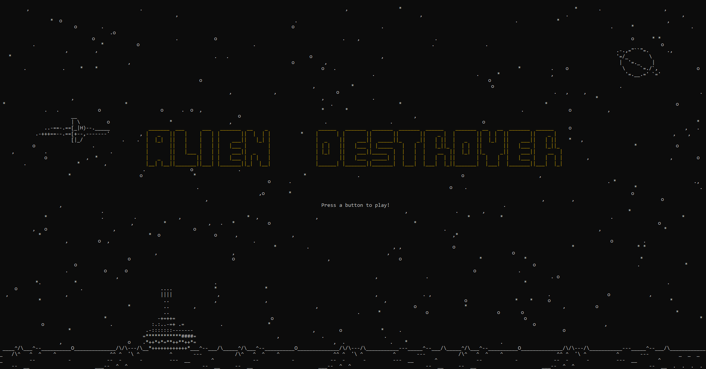

# Alien-Destroyer-a-C-terminal-based-game

Alien-Destroyer is a simple game implemented in C that allows you to play a space-invade-like game right in your Windows terminal.



## Features
- Classic space-invader-like gameplay
- Smooth graphics and animations using Windows terminal
- Simple controls for movement and shooting

## How to Play
1. Clone or download the repository to your local machine.
2. Compile the source code using your preferred C compiler (e.g., GCC) including the ncurses library.
```console
gcc Alien-Destroyer.c -lncurses -o Alien-Destroyer.exe
```
4. Run the executable to start the game.
5. Use the 'A' and 'D' keys to move the tank left and right.
6. Press 'W' to fire rockets from the tank and destroy aliens.
7. Avoid getting hit by alien projectiles to maintain your health.
8. Survive as long as possible and aim for the highest score!

## Dependencies
- Windows operating system
- C compiler (e.g., GCC)
- Windows.h library for Windows-specific functionality
- ncurses.h library

## Gameplay demo


## Contributions
Contributions are welcome! Feel free to submit pull requests or open issues for any improvements, bug fixes, or feature requests.

## License
This project is licensed under the [MIT License](LICENSE).

Enjoy playing Alien Destroyer!
